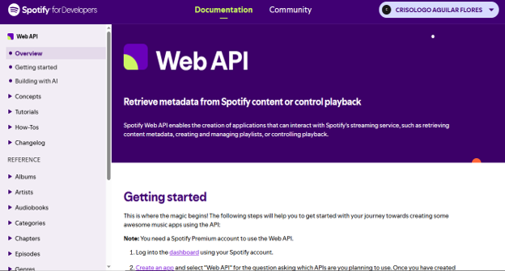
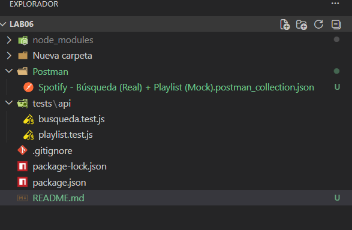
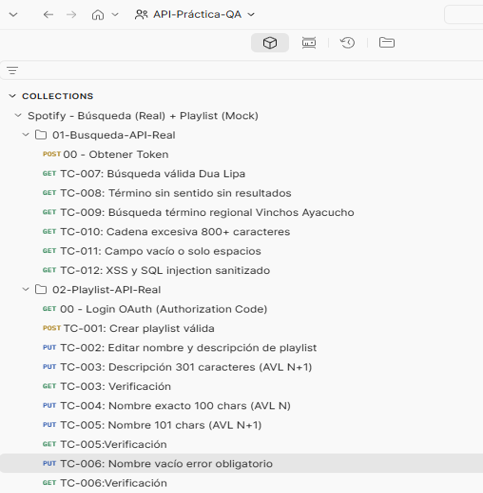

# 🎵 Informe Monográfico y API Testing: Spotify Web API - Lab 06


## 📄 Resumen Ejecutivo

[cite_start]El presente informe monográfico documenta el proceso completo de diseño, configuración, ejecución y análisis de pruebas de interfaz de programación de aplicaciones (API) REST sobre la Spotify Web API, desarrolladas para el Laboratorio 06 de la asignatura IS-489 Pruebas y Aseguramiento de Calidad de Software[cite: 228]. [cite_start]El estudio evaluó un total de 12 casos de prueba (requerimientos SPOT-21 a SPOT-32 del Sprint 5) distribuidos en dos módulos clave: Búsqueda (TC-007 a TC-012) y Gestión de Playlists (TC-001 a TC-006)[cite: 229]. 

[cite_start]Los resultados evidenciaron 8 casos aprobados y 4 fallos documentados como hallazgos de calidad, revelando discrepancias entre los criterios de aceptación y el comportamiento real de la API REST[cite: 233].

---

## 📚 Análisis de Documentación de la API

[cite_start]Para el diseño de los casos de prueba, se tomó como base técnica la documentación oficial de Spotify Web API, que es una API REST de nivel empresarial que proporciona acceso programático al catálogo de Spotify[cite: 360]. [cite_start]Se evaluaron los endpoints `GET /v1/search`, `POST /v1/me/playlists` y `PUT /v1/playlists/{playlist_id}`[cite: 366, 367, 368].


*Figura 1: Referencia de la documentación oficial de Spotify Web API.*

---

## 📂 Estructura del Proyecto

[cite_start]Todo el trabajo fue versionado modularmente para separar la configuración, las colecciones de pruebas y los entornos, asegurando la reproducibilidad[cite: 234].


*Figura 2: Estructura del directorio de trabajo en Visual Studio Code.*

---

## 📊 Matriz de Pruebas de Endpoints (Ejecución y Análisis)

[cite_start]A continuación, se detalla el análisis y los resultados de las pruebas realizadas mediante Postman a los endpoints seleccionados, cumpliendo con los parámetros de evaluación requeridos[cite: 149].

### 1. Módulo Búsqueda (Autenticación: *Client Credentials Flow*)

| ID | Método | URL del Endpoint | Parámetros Enviados (Query) | Cód. HTTP | Respuesta Obtenida (Body/JSON) | Estado |
|:---|:---:|:---|:---|:---:|:---|:---:|
| **TC-007** | `GET` | `/v1/search` | `q=Dua Lipa`, `type=artist` | **200 OK** | `total: 14`, `items[0].name='Dua Lipa'` | ✅ PASS |
| **TC-008** | `GET` | `/v1/search` | `q=xkqzmpwvlrfbnt2026ayacucho`, `type=track` | **200 OK** | `total: 3` (Fuzzy matching detectó 'ayacucho') | ❌ FAIL |
| **TC-009** | `GET` | `/v1/search` | `q=Vinchos Ayacucho`, `type=track` | **200 OK** | `total: 3` (Música andina regional) | ✅ PASS |
| **TC-010** | `GET` | `/v1/search` | `q='x'`×850 caracteres, `type=track` | **400 Bad Request** | `error: 'Query exceeds maximum length of 250 characters'` | ✅ PASS* |
| **TC-011** | `GET` | `/v1/search` | `q=''` (vacío), `type=track` | **400 Bad Request** | `error.message: 'No search query'` | ✅ PASS* |
| **TC-012** | `GET` | `/v1/search` | `q=<script>alert('xss')</script>' OR 1=1--`, `type=track` | **200 OK** | `total: 951` (Payload tratado como texto plano sin ejecución) | ✅ PASS |

[cite_start]*(Nota de calidad: Los casos TC-010 y TC-011 se marcaron como PASS con observación, ya que un código 400 controlado es un rechazo seguro y válido, aunque el criterio original exigía truncamiento o cero resultados sin error [cite: 111, 112, 113, 118, 151, 152][cite_start]).* [cite: 150]

### 2. Módulo Gestión de Playlists (Autenticación: *Authorization Code Flow*)

| ID | Método | URL del Endpoint | Parámetros Enviados (Body JSON) | Cód. HTTP | Respuesta Obtenida (Body/JSON) | Estado |
|:---|:---:|:---|:---|:---:|:---|:---:|
| **TC-001** | `POST` | `/v1/me/playlists` | `name`, `description`, `public:false` | **201 Created** | Retornó `id` autogenerado, nombre y desc correctos | ✅ PASS |
| **TC-002** | `PUT` | `/v1/playlists/{id}` | `name editado`, `description editada` | **200 OK** | Body vacío. Confirmado por `GET` de verificación | ✅ PASS |
| **TC-003** | `PUT` | `/v1/playlists/{id}` | `description:` 'A'×301 caracteres | **200 OK** | Spotify no truncó. Almacenó 305 caracteres íntegros | ❌ FAIL |
| **TC-004** | `PUT` | `/v1/playlists/{id}` | `name:` 'B'×100 caracteres | **200 OK** | Nombre de 100 caracteres almacenado íntegramente | ✅ PASS |
| **TC-005** | `PUT` | `/v1/playlists/{id}` | `name:` 'C'×101 caracteres | **200 OK** | Spotify no truncó ni rechazó. Almacenó los 101 chars | ❌ FAIL |
| **TC-006** | `PUT` | `/v1/playlists/{id}` | `name: ""` | **200 OK** | Ignoró el campo vacío, conservó valor anterior | ❌ FAIL |
[cite_start][cite: 152]

---

## 🛠️ Entornos de Ejecución

[cite_start]El proyecto empleó dos herramientas complementarias[cite: 230]: 

### 1. Pruebas Manuales Interactivos (Postman Desktop)
[cite_start]Se implementaron validaciones mediante scripts `pm.test()` con la librería de assertions Chai en la pestaña *Scripts > Post-response*[cite: 230, 352]. Esto permitió extraer automáticamente tokens, parsear las respuestas JSON y emitir veredictos.


*Figura 3: Ejecución de la colección de pruebas en Postman Desktop.*

### 2. Automatización como Código (Jest + Supertest)
[cite_start]Para asegurar la integrabilidad del proyecto, el 100% de las pruebas ejecutadas en Postman fueron transcritas a scripts automatizados con JavaScript utilizando Supertest y Jest, permitiendo su ejecución directa mediante la consola[cite: 231, 354, 358].

Comando para lanzar la batería de pruebas:
```bash
npm test