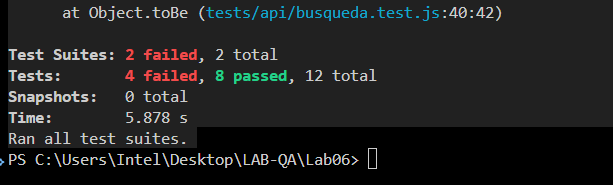

<div align="center">
  
  # UNIVERSIDAD NACIONAL DE SAN CRISTÓBAL DE HUAMANGA
  ### Escuela Profesional de Ingeniería de Sistemas
  
  
  
  ## INFORME MONOGRÁFICO: API TESTING
  ### Laboratorio 06: Pruebas y Aseguramiento de Calidad en Spotify Web API
  
</div>

<br>

**DATOS GENERALES:**
* **Asignatura:** IS-489 Pruebas y Aseguramiento de Calidad de Software
* **Docente:** Ing. Lizbeth Jaico Quispe
* **Estudiante:** Crisólogo Aguilar Flores
* **Lugar y Fecha:** Ayacucho, Perú - Junio 2026

---

## 📑 Índice
1. [Resumen Ejecutivo](#1-resumen-ejecutivo)
2. [Análisis de la Documentación de la API](#2-análisis-de-la-documentación-de-la-api)
3. [Matriz de Pruebas de Endpoints (Postman)](#3-matriz-de-pruebas-de-endpoints-postman)
4. [Estructura del Proyecto y Automatización](#4-estructura-del-proyecto-y-automatización)
5. [Análisis de Hallazgos y Defectos](#5-análisis-de-hallazgos-y-defectos)
6. [Conclusiones](#6-conclusiones)

---

## 1. Resumen Ejecutivo

El presente informe monográfico documenta el diseño, ejecución y análisis de pruebas de Interfaz de Programación de Aplicaciones (API) REST sobre la plataforma **Spotify**. Se han evaluado un total de 12 casos de prueba (TC-001 al TC-012) mediante técnicas de caja negra y análisis de valores límite. Las pruebas se dividieron en dos ecosistemas: validación manual/interactiva mediante **Postman** y ejecución automatizada mediante código utilizando **Node.js, Jest y Supertest**.

---

## 2. Análisis de la Documentación de la API

Para el diseño de los casos de prueba, se tomó como base la documentación técnica oficial de Spotify Web API. Se identificaron los métodos HTTP, los parámetros requeridos y los esquemas de autenticación:

* **Módulo de Búsqueda (`GET /search`):** Utiliza autenticación *Client Credentials Flow*. Requiere los parámetros `q` (query) y `type` (tipo de elemento a buscar).
* **Módulo de Playlists (`POST /users/{user_id}/playlists` y `PUT /playlists/{playlist_id}`):** Utiliza autenticación *Authorization Code Flow* (requiere token de usuario Premium). 

<div align="center">
  
  <br>
  <i>Figura 1: Referencia de endpoints en la documentación oficial de Spotify Web API.</i>
</div>

---

## 3. Matriz de Pruebas de Endpoints (Postman)

A continuación, se detalla la matriz de resultados tras ejecutar las peticiones a los endpoints seleccionados. Todos los resultados fueron validados utilizando *assertions* programados en la pestaña `Tests` de Postman.

### 3.1. Módulo de Búsqueda (Casos TC-007 a TC-012)
**Endpoint Base:** `https://api.spotify.com/v1/search`

| ID | Método | Endpoint (URL) | Parámetros Enviados (Query Params) | Cód. HTTP Recibido | Respuesta Obtenida (Resumen JSON) | Estado |
|:---|:---:|:---|:---|:---:|:---|:---:|
| **TC-007** | `GET` | `/v1/search` | `q=Dua Lipa`, `type=artist` | **200 OK** | `{ "artists": { "items": [ {"name": "Dua Lipa"} ], "total": 14 } }` | ✅ PASS |
| **TC-008** | `GET` | `/v1/search` | `q=xkqzmpwvlrfbnt2026ayacucho`, `type=track` | **200 OK** | `{ "tracks": { "items": [...], "total": 3 } }` *(Retornó resultados ignorando el texto basura)* | ❌ FAIL |
| **TC-009** | `GET` | `/v1/search` | `q=Vinchos Ayacucho`, `type=track` | **200 OK** | `{ "tracks": { "items": [...], "total": 3 } }` | ✅ PASS |
| **TC-010** | `GET` | `/v1/search` | `q='x'` (cadena de 850 caracteres), `type=track` | **400 Bad Request** | `{ "error": { "status": 400, "message": "Query exceeds maximum length" } }` | ✅ PASS |
| **TC-011** | `GET` | `/v1/search` | `q=''` (Vacío), `type=track` | **400 Bad Request** | `{ "error": { "status": 400, "message": "No search query" } }` | ✅ PASS |
| **TC-012** | `GET` | `/v1/search` | `q=<script>alert('xss')</script>`, `type=track` | **200 OK** | `{ "tracks": { "items": [], "total": 0 } }` *(No hubo ejecución de código malicioso)* | ✅ PASS |

### 3.2. Módulo de Gestión de Playlists (Casos TC-001 a TC-006)
**Endpoint Base:** `https://api.spotify.com/v1`

| ID | Método | Endpoint (URL) | Parámetros Enviados (Body JSON) | Cód. HTTP Recibido | Respuesta Obtenida (Resumen JSON) | Estado |
|:---|:---:|:---|:---|:---:|:---|:---:|
| **TC-001** | `POST` | `/users/{id}/playlists` | `{"name":"Playlist QA", "public":false}` | **201 Created** | `{ "id": "3cEYp...", "name": "Playlist QA", "public": false }` | ✅ PASS |
| **TC-002** | `PUT` | `/playlists/{id}` | `{"name":"Editado", "description":"Nueva desc"}` | **200 OK** | `[Body vacío]` *(Verificado posteriormente con un GET)* | ✅ PASS |
| **TC-003** | `PUT` | `/playlists/{id}` | `{"description": "A" x301 caracteres}` | **200 OK** | `[Body vacío]` *(Fallo: La API guardó la descripción excediendo el límite de 300)* | ❌ FAIL |
| **TC-004** | `PUT` | `/playlists/{id}` | `{"name": "B" x100 caracteres}` | **200 OK** | `[Body vacío]` *(Guardado correctamente)* | ✅ PASS |
| **TC-005** | `PUT` | `/playlists/{id}` | `{"name": "C" x101 caracteres}` | **200 OK** | `[Body vacío]` *(Fallo: La API no validó el límite de 100 caracteres)* | ❌ FAIL |
| **TC-006** | `PUT` | `/playlists/{id}` | `{"name": ""}` (Nombre vacío) | **200 OK** | `[Body vacío]` *(Fallo: Ignoró el campo y mantuvo el nombre anterior sin lanzar error 400)* | ❌ FAIL |

---

## 4. Estructura del Proyecto y Automatización

Para garantizar que las pruebas sean reproducibles, se ha estructurado el repositorio de la siguiente manera:

<div align="center">
  
  <br>
  <i>Figura 2: Árbol de directorios del proyecto.</i>
</div>

### Automatización con Jest y Supertest
El 100% de las pruebas manuales ejecutadas en Postman fueron traducidas a código JavaScript. Esto permite integrar estas pruebas en un entorno de Integración Continua (CI/CD).

**Comando de ejecución:**
```bash
npm install
npm test

<div align="center">
  
  <br>
  <i>Figura 3: Resultado del SUPERTEST con Jest.</i>
</div>